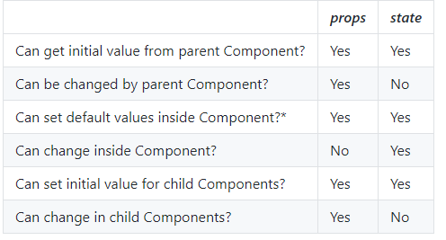

# Kiến thức

## Frontend Basic

### HTML5

HTML hoặc Hyper-Text Markup Language có thể được hiểu là ngôn ngữ chính của WordWide Web. Hầu hết những trang web được host trên mạng đều được viết bởi vài phiên bản của HTML, qua đó ta cs thể  đảm bảo rằng các tài nguyên như văn bản, multimedia, hyperlink có thể hiển thị được trên trình duyệt.

HTML5 là phiên bản mới nhất của HTML hiện tại nhằm mục đích tăng trải nghiệm người dùng, hỗ trợ thêm một số chức năng
- SVG, canvas và các hình vector được hỗ trợ
- Sử dụng web SQL database, application cache để lưu dữ liệu tạm tăng tốc độ 
- Html không cho JS chạy trong webrower nhưng HTML hỗ trợ hoàn toàn cho việc đó.
- Hỗ trợ thêm các thuộc tính thành phần của form như ngày giờ, email, số lượng, số điện thoai,...
- Có một số thẻ mới được hỗ trợ như footer, header, video, audio...

Uư điểm của HTML5 đối với người dùng
- Hỗ trợ thêm trên các nền tảng mobile browser giúp người dùng có thể duyệt web trên các nền tảng khác như mobile
- Hỗ trợ hoàn toàn adio và video mà không cần tải các plugin đi kèm, tăng trải nghiêm người dùng

### CSS3

Là phiên bản mới nhất của CSS, chứa tất cả mọi thứ có trong phiên bản trước và bổ sung thêm các tính năng mới. CSS3 được tách ra thành nhiều module như

- Selectors
- Box model
- Background and Borders
- Image Values and Replaced Content
- Text Effects
- 2D/3D Transformations
- Animations
- Multiple Column Layout
- User Interface

Trong đó có một số phần quan trọng như

#### Selectors

Dùng để truy vấn đến các thẻ HTML dựa theo  ID, class name,... ở CSS3 mở rộng dựa trên các selector theo thuộc tính. Ví dụ  Ghép bất kỳ phần tử E nào có thuộc tính attr kết thúc bằng val. Nói cách khác, val khớp với phần cuối của giá trị thuộc tính.

```html
a [href $ = '. jsp'] {màu: tím;}
```

#### Box model

Kết hợp ba thuộc tính margin, padding và border và nội dung của chúng có thể là text hoặc hình ảnh sẽ tạo ra được box model.


Content: là nội dung có thể là kí tự hoặc hình ảnh

Padding: là thuộc tính dùng để tạo ra một vùng khoảng trống bao bọc xung quanh content và nó sẽ nằm bên trong border

Border là phần khung bao quanh padding và content, có cấu trúc chủ yếu như sau
- border-width: độ rộng của border tính bằng các đơn vị như: in px, pt, cm, em, etc
- border-style: style cho border như kiểu đường thằng, chấm bi, song nét,... (solid, dotted, double,.. )
- border-color: màu cho border và được xét bởi nhiều cách: tên màu, giá trị hexa, giá trị rgb hay là trong suốt (transparent)

Margin là phần tử ngoài cùng, là thuộc tính dùng để tạo khoảng cách xung quanh element để cách element đó với các thứ khác và phần margin sẽ nằm bên ngoài border

#### Flexbox 

Flexbox là một kiểu dàn trang (layout mode) mà nó sẽ tự cân đối kích thước của các phần tử bên trong để hiển thị trên mọi thiết bị. Nói theo cách khác, bạn không cần thiết lập kích thước của phần tử, không cần cho nó float, chỉ cần thiết lập nó hiển thị chiều ngang hay chiều dọc, lúc đó các phần tử bên trong có thể hiển thị theo ý muốn.

Sơ đồ cấu trúc của Flexbox


Hai thành phần quan trọng nhất trong một bố cục Flexbox là gồm container và item:

Container: là thành phần lớn bao quanh các phần tử bên trong, bạn sẽ thiết lập kiểu hiển thị inline (sắp xếp theo chiều ngang) hoặc kiểu sắp xếp theo chiều dọc. Khi đó, các item bên trong sẽ hiển thị dựa trên thiết lập của container này.

Item: Các phần tử con của container được gọi là item, ở item bạn có thể thiết lập nó sẽ sử dụng bao nhiêu cột trong một container, hoặc thiết lập thứ tự hiển thị của nó.

sử dụng thuộc tính flex-direction: row | column | row-reverse | column-reverse để điều chỉnh, cụ thể:

- Row: Chuyển trục main axis thành chiều ngang, nghĩa là hiển thị theo hàng.
- Colum: Chuyển trục main axis thành chiều dọc, nghĩa là hiển thị theo cột.
- Row-reverse: Hiển thị theo hàng nhưng đảo ngược vị trí các item.
- Column-reverse: Hiển thị theo cột nhưng đảo ngược vị trí các item.

#### Media query

là sự cải tiến của media type đã tồn tại từ CSS2, bằng cách thêm những thuộc tính vào cú pháp query để đáp ứng được cho nhiều thiết bị với nhiều kích cỡ màn hình khác nhau. Vì hiện nay không chỉ có nhu cầu truy cập web trên laptop và desktop còn trên các thiết bị khác như điện thoại table, để với các màn hình khác nhau ta cần hiển thị một cách hợp lí, trách tình trạng giảm tốc độ load trang trên thiết bị di động khi load những hình ảnh cỡ lớn.

`@media media_type (feature:value) { rules }`
 
Có các loại media type như
- All: Dùng cho tất cả các loại Media Type
- Aural: Dùng cho speech and sound synthesizers
- Braille: Dùng cho các devices liên quan đến chữ nổi (braille)
- Embossed: Dùng cho các loại máy in các trang braille
- Handheld: Dùng cho các thiết bị nhỏ, thiết bị cầm tay
- Print: Dùng cho máy in
- Projection: Dùng cho các loại máy chiếu
- Screen: Dùng cho computer screen
- Tty: Dùng cho các thiết bị sử dụng fixed-pitch character grid
- Tv: Dùng cho các loại TV

### Responsive web design

Responsive Web Design là làm cho trang web có thể xem tốt trên tất cả các thiết bị. Responsive Web Design chỉ sử dụng HTML và CSS. Để mang lại trải nghiệm tốt cho người dùng

Lợi ích
- Nâng cao trải nghiệm cho người dùng: cung cấp các trải nghiệm người dùng tối ưu bất kể họ sử dụng một máy tính để bàn, một điện thoại thông minh, máy tính bảng hay một smart-TV. Nội dung web phải luôn nằm trong giới hạn kích thước của chiều ngang màn hình, người dùng chỉ cần cuộn dọc từ trên xuống để xem được hết nội dung của trang web dễ dàng. Vì vây, nếu để người dùng phải cuộn ngang hoặc zoom trang web mới xem được toàn bộ nội dung sẽ không phải là RWD và dẫn đến trải nghiệm người dùng kém

- Tiết kiệm chi phí: So với việc phải thiết kế 2 phiên bản web riêng biệt cho điên thoại và PC thì thiết kế 1 trang web tương thích với tất cả thiết bị sẽ tiết kiệm hơn là điều đương nhiên.
- Dễ dàng trong việc quản lý: Việc quản trị duy nhất một website sẽ giúp bạn tiết kiệm công sức và thời gian hơn.

Quy tắc khi thực hiện Responsive web design
- Không sử dụng các HTML element có chiều rộng cố định quá lớn: Một hình ảnh có chiều rộng quá lớn so với chiều rộng của các thiết bị nhỏ thì khi hiển thị trên các thiết bị này hình ảnh sẽ bị tràn ra ngoài và cần phải cuộn ngang để xem được toàn bộ ảnh
- Sử dụng CSS media queries để style cho từng thiết bị có chiều rộng khác nhau: điều này sẽ làm cho nội dung của trang web sẽ bị tràn khi xem ở thiết bị có chiều rộng nhỏ hơn giá trị đã thiết lập
- Sử dụng icon SVG thay cho icon hỉnh ảnh thông thường (JPG, PNG,...): các icon này sẽ không bị mờ khi phóng to thu nhỏ

### Màu sắc trong thiết kế Web

Có 5 kiểu kết hợp màu hay được dùng nhất là
- Monochromatic: Cách kết hợp này là sử dụng độ bóng và độ bão hòa (saturation) của cùng 1 màu
- Complementary (Tương phản): Cách kết hợp này được dùng khi bạn muốn tạo một sự tương phản mạnh mẽ. Màu tương phản là 2 màu đối diện nhau trong vòng tuần hoàn màu sắc. 
- Triadic (Tam giác): Cách kết hợp này là của 3 màu nằm tại các đỉnh của một tam giác đều trên vòng tuần hoàn màu sắc. Cách này vẫn giữ được độ tương phản mà hài hòa hơn cách kết hợp màu tương phản. Tuy nhiên cũng chỉ nên chọn một màu chủ đạo, dùng nhiều hơn.
- Tetradic (Hình chữ nhật): Đây là cách kết hợp sử dụng 4 màu trong đó có 2 cặp màu tương phản, cách này vừa rực rỡ lại vừa cân bằng và có thể tạo thành rất nhiều biến thể. Tuy nhiên khá khó để cân bằng màu nóng, màu lạnh, vì vậy chỉ nên dùng 1 màu làm chủ đạo
- Analogous (Tương tự): Màu tương tự là các màu sắc nằm cạnh nhau trong vòng tuần hoàn, thường thì chúng khá ăn nhập với nhau, tạo cảm giác êm ái, dễ chịu. Cách kết hợp này thường tìm thấy trong tự nhiên, tạo cảm giác dễ chịu cho mắt. Cách tốt nhất để sử dụng cách này là dùng một màu làm chủ đạo, màu thứ hai để củng cố, màu thứ 3 dùng kèm với trắng, đen, xám để tô điểm. 

Sắc thái, bóng và tông màu
- Sắc thái: Làm sáng tông màu bằng cách pha thêm màu trắng
- Bóng: Làm màu tối đi, đậm hơn bằng cách thêm màu đen vào
- Tông màu: Thêm hoặc bớt màu ghi để tạo cảm giác màu lạnh hoặc ấm hơn

## Javascrip

Javascipt Syntax https://www.w3schools.com/js/js_syntax.asp

### Async trong JavaScript: Callback, Promise, Async/Await, Callback hell

#### Callback

Gọi lại là một function sẽ được thực thi sau khi một function khác đã được thực thi xong - do đó nó có tên là callback(gọi lại) để đảm bảo Js thực hiện đúng thứ tự ta định sẵn, ta cần sử dụng đến khái niệm callback function. Do trong javascript thay vì chờ đợi phản hồi, Javascript vẫn sẽ tiếp tục thực thi các lệnh tiếp theo, đồng thời chờ đợi phản hồi từ các sự việc khác.

Ví dụ cụ thể như sau, giả sửa ta có hai hàm dohomework và thông báo hoàn thành bài tập ta cần chắc chắc đảm bảo rằng làm bài tập xong mới thông báo thì nên thực hiện theo lời gọi callback function.

Nếu ta thực hiện như sau

Theo thông thường nếu ta thực hiện theo kiểu như sau

```javascript
function doHomework() {
    setTimeout( function(){
  console.log(`Starting my homework.`);
  }, 500 );

}

function finishedWork() {
  console.log('Finished my homework');
};
doHomework();
finishedWork();

```

Do doHomeWork cần thời gian để xử lí nhưng JS không đợi hàm dohomework thực hiện xong mà nó sẽ thực hiện finishedWork luôn do đó ta sẽ không đảm bảo được việc làm việc xong mới thông báo kết thúc.

```javascript
function doHomework(subject, callback) {
  alert(`Starting my ${subject} homework.`);
  callback();
}

doHomework('math', function() {
  alert('Finished my homework');
});
```

#### Promise

Bằng các sử dụng Promise  ta có thể kết hợp với các hàm xử lý khác để sử dụng kết quả sau khi thực thi của xử lý bất đồng. Vì vậy mà ta có thể lập trình bất đồng bộ gần giống với kiểu lập trình đồng bộ - tức là đợi xử lý bất đồng bộ xong mới thực thi các thao tác mà cần sử dụng tới kết quả của xử lý đó.

Tại mỗi thời điểm Promise sẽ có thể ở một trong các trạng thái sau:

- pending: Trạng thái chờ xử lý kết thúc. Trạng thái này chính là trạng thái ban đầu của Promise, nó thể hiện rằng thao tác xử lý của ta chưa kết thúc.
- fulfilled: Trạng thái xử lý thành công. Trạng thái này thể hiện rằng thao tác xử lý của ta đã kết thúc và thành công.
- rejected: Trạng thái xử lý thất bại. Trạng thái này thể hiện thao tác xử lý đã kết thúc và thất bại.

Sau khi xử lý kết thúc, bất kể trạng thái được chuyển thành là thành công hay thất bại thì các hàm xử lý được đính kèm sẽ được gọi thực thi. Để đính kèm một hàm cho Promise, ta có thể sử dụng `Promise.prototype.then()` cho trường hợp thành công và `Promise.prototype.catch()` cho trường hợp xử lý thất bại.

#### Async/Await

Hàm async cho phép ta viết các thao tác bất đồng bộ với phong cách của các mã đồng bộ. Bằng cách viết như vậy, mã nguồn của ta trông sẽ sáng sủa, dễ đọc hơn và "dễ hiểu hơn" khác phục tình trạng Promise hell và callback hell: các thứ khiến ch mã nguồn rối, phức tạp, lòng nhau và khó bảo trì nhưng vẫn sử dụng Async/await bên dưới.

#### Callback hell

callback hell trong javascript chỉ là bạn thực hiện quá nhiều callback lồng nhau, ví dụ

```javascript
getData(function(a){  
    getMoreData(a, function(b){
        getMoreData(b, function(c){ 
            getMoreData(c, function(d){ 
                getMoreData(d, function(e){ 
                    ...
                });
            });
        });
    });
});
```

### Closure

Xét đoạn code sau

```javascript
function makeFunc() {
  var name = 'Mozilla';
  function displayName() {
    alert(name);
  }
  return displayName;
}

var myFunc = makeFunc();
myFunc();
```
Trong trường hợp này, myFunc đang tham chiếu đến một instance displayName được tạo ra khi chạy makeFunc. Instance của displayName sẽ duy trì lexical environment, biến name sẽ vẫn tồn tại. Với lý do này, khi gọi hàm myFunc , giá trị biến name vẫn có và chuỗi "Mozilla" sẽ được đưa vào hàm alert.

### Lodash

Lodash là một thư viện JavaScript mạnh mẽ dùng để xử lý Array, Object, Function, Collection ..v.v. Các hàm tiện ích được chia làm các nhóm chính sau : Array, Collection,Function, Lang, Math, Number, Object, Seq, String, Util.

Ví dụ một số hàm như

`_.fill(array, value, [start=0], [end=array.length]) `: Ghi đè phần tử vào mảng từ vị trí bắt đầu đến trước vị trí kết thúc

`_.filter(collection, [predicate=_.identity])` Lặp qua tất cả các phần tử trong mảng, tìm phần tử với điều kiện xác định. Và trả về phần tử tìm được nếu có

## React

### Component, State và Props, Life Cycle, JSX

#### Component

là một Javascript class hoặc một hàm với các tùy chọn đầu vào khác nhau như properties (props) và return các React element để định nghĩa giao diện của người dùng như thế nào.

`const Greeting = () => <h1>Hello World today!</h1>;
`
Có 2 loại component
- Functional component: Đây là component được khai báo dưới dạng 1 function, do đó nó là một stateless component, và output (được rendered) chỉ phụ thuộc vào props truyền vào cho function.
  - Nếu không cần quản lí bất kì state nào nên sử dụng nó thì nó chỉ phụ thuộc vào input của hàm
  - Quản lí logic dễ hơn vì nó không phụ thuộc vào state
  - Re-render xảy ra liên tục khi component cha cập nhật
  - Dùng cho việc chỉ hiển thị view và tái sử dụng dễ dàng, để quản lí appp một cách dễ dàng  nhưng performance không tốt.


- React Component & Pure Component: có đầy đủ các life cycle để ta có thể tạo ra các code logic xử lý đặc thù trước hoặc sau khi render. Pure Component có sự khác biệt so với React Component là khi có sự thay đổi ở lớp thì nó không lập tức thay đổi component con trực tiếp mà sẽ check xem props có thay đổi thì mới re-render bằng cách sử dụng method shouldComponentUpdate.


#### JSX

Là file có đuôi .jsx chứa có pháp của HTMl và Javascript, trong React file jsx thường là một componet để tạo giao diện cho trình duyệt. Một đối tượng jsx chỉ render duy nhất một thẻ html. JSX tối ưu hóa code khi biên soạn, vì vậy nó chạy nhanh hơn so với code JavaScript tương đương.

#### State and Props

Là các thuộc tính của react Component
- State lưu giữ thông tin về Component và cách xử lí khi thông tin này thay đổi. Mặc định thì component này không có state (như một biến được khái báo trong hàm). Sử dụng state khi cần theo dõi thông tin về việc hiển thị các thành phần có thể tạo, cập nhật. State được tạo bên trong component và có thể được thay đổi bởi hàm setsate
- Props thì mang tính external, và không bị kiểm soát bởi bản thân component. Nó được truyền từ component cao hơn theo phân cấp, hay có thể hiểu đơn giản là truyền từ component cha xuống component con. props được truyền vào component và không thể thay đổi trong cả quá trình



#### Life cycle


##### Initialization

Tương tự hàm khởi tạo (constructor) được gọi đến khi một thể hiện của component được tạo ra.

##### Mounting

Là các hàm gắn kết, kết nối các component với nhau.

`componentWillMount()`: Được gọi đến trước khi hiển thị component ra ngoài trình duyệt. Quá trình này diễn ra hết sức nhanh chóng, nên không thực hiện nhiều thao tác tại đây

`Render()`: Được gọi khi hiển thị component ra ngoài trình duyệt. Được gọi khi hiển thị component ra ngoài trình duyệt.

`componentDidMount()`: Được gọi sau khi đã hiển thị component ra ngoài trình duyệt, và hàm này được thực hiện một lần duy nhất. Hàm này được gọi để thông báo component đã tồn tại trên DOM, từ đó các thao tác trên DOM có thể thực hiện bình thường với component này.

##### Updation 

Xảy ra khi update component ở props và state

`componentWillReceiveProps(nextProps)`: Hàm này được chạy khi mà props của component đã được sinh ra có sự thay đổi.
Phải gọi setState() nếu muốn render lại.

shouldComponentUpdate(nextProps, nextState): Được thực hiện ngay sau khi state và props thay đổi. sẽ trả về kết quả true or false. Phương thức này sẽ xác định 1 component có được update hay không. Mặc định giá trị này là true. Nếu bạn không muốn component render lại sau khi update state hay props thì return giá trị thành false.

componentWillUpdate(nextProps, nextState): Được gọi khi chúng ta update state của component trước khi nó render lại.
Hàm render sẽ được gọi ngay sau hàm này.

componentDidUpdate(prevProps, prevState): sẽ được gọi sau khi render HTML được loading xong.


##### Unmounting

componentWillUnmount(): Được gọi trước khi một component bị remove khỏi một DOM.


### React Router

React Router là một thư viện định tuyến (routing) tiêu chuẩn trong React. Nó giữ cho giao diện của ứng dụng đồng bộ với URL trên trình duyệt. React Router cho phép bạn định tuyến "luồng dữ liệu"(data flow) trong ứng dụng của bạn một cách rõ ràng. Nếu truy cập vào URL nào thì sẽ có dữ liệu và giao diện tương ứng.


React là  một thư viện JS  để lập trình single page application với rất nhiều component để xây dựng view giao diện, và bản thân react không có Router. Vì vậy cần React Router để thực hiện việc này, giúpđịnh nghĩa ra các URL động, và lựa chọn Component phù hợp để hiển thị trên trình duyệt người dùng ứng với từng URL.

React Router có 2 thành phần chính là  <BrowserRouter> & <HashRouter>. <BrowserRouter> được sử dụng phổ biến hơn, nó sử dụng History API có trong HTML5 để theo dõi lịch sử bộ định tuyến còn <HashRouter> sử dụng hash của URL ( window.location.hash) để ghi nhớ mọi thứ. 


```javascript
<BrowserRouter>
  <Route exact path="/" component={Home}/>
  <Route path="/about" component={About}/>
  <Route path="/topics" component={Topics}/>
</BrowserRouter>
 
 
<HashRouter>
  <Route exact path="/" component={Home}/>
  <Route path="/about" component={About}/>
  <Route path="/topics" component={Topics}/>
</HashRouter>
```

### State Management: Redux, MobX. Khi nào cần dùng một State Management?

#### Redux

Redux là một predictable state management tool cho các ứng dụng Javascript. Với một ứng dụng cần chia sẻ state với component khác hay component cần thay đổi state của một component khác, chúng ta phải quản lý nhiều state hơn. Với Redux, state của ứng dụng được giữ trong một nơi gọi là store và mỗi componentđều có thể access bất kỳ state nào mà chúng muốn từ chúng store này.


#### Khi nào cần dùng một State Management?

Khi hình huống một state phải được chia sẻ giữa các component cách xa nhau trong một tree và state này phải được pass từ một nơi này đến component chứa tất cả các component cần sate đó và pass xuống tất cả các component đó.
Điều đó gây khó khăn trong việc quản lí state trong app trở nên bừa bộn. Đó là lý do vì sao ta cần state management tool.


## Tham khảo
https://www.hostinger.vn/huong-dan/khac-biet-giua-html-va-html5/

https://viblo.asia/p/tim-hieu-ve-media-query-3ZabG9oRzY6E

https://thachpham.com/web-development/html-css/huong-dan-css3-flexbox-toan-tap.html

https://viblo.asia/p/tim-hieu-ve-media-queries-cho-viec-reponsive-web-design-w5WQvzZnvk3E

https://viblo.asia/p/co-ban-ve-ket-hop-mau-sac-trong-thiet-ke-website-yMnKMq0rK7P

https://developer.mozilla.org/vi/docs/Web/JavaScript/Reference/Global_Objects/Promise


